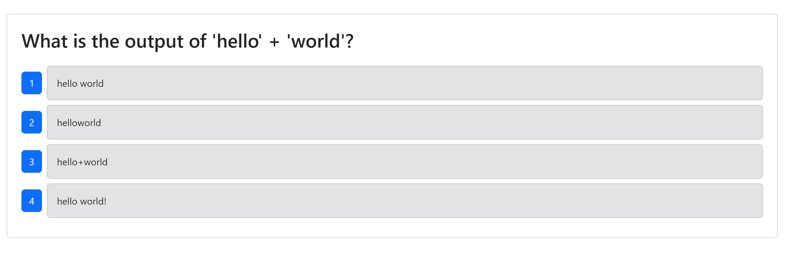
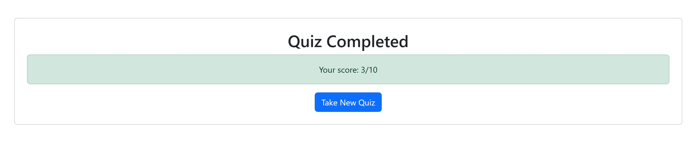
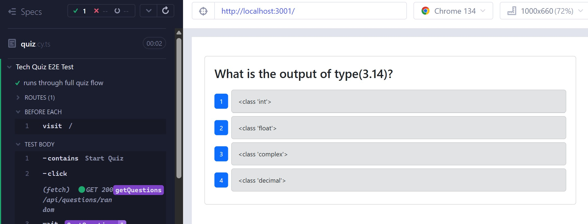
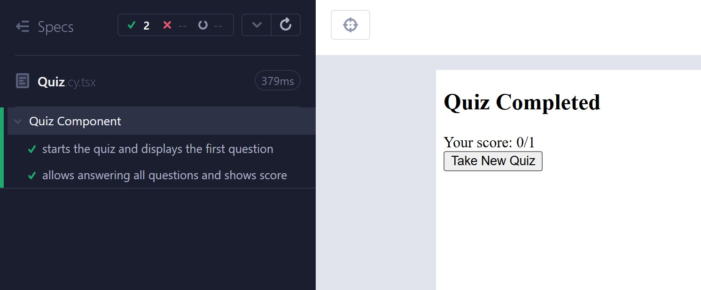

# Tech Quiz

## Table of Contents
- [Description](#description)
- [Screenshots](#screenshots)
- [Installation](#installation)
- [Usage](#usage)
- [License](#license)
- [Contributing](#contributing)
- [Tests](#tests)
- [Credit](#credit)
- [Project Links](#project-links)
- [Questions](#questions)

## Description

Take a quiz of ten random questions and view the final score.

## Screenshots

Here are some previews of the web page:

###  Test Questions

### Quiz Complete Page

### e2e Cypress Testing

### Component Cypress Testing

## Installation
1. Clone the repository.
2. Run `npm install` in the root of the project.
3. Navigate to the client folder and run `npm install` again to install frontend dependencies.
4. Make a .env file using the code from the .env.EXAMPLE file.
5. To seed the database, from the root of the project, run `npm run build` and `npm run seed` in your terminal.

## Usage

1. In the root terminal (1) run `npm run start`.
2. Open another terminal (2) and run `cd client`.
3. Then run `npm run dev`.
4. Open another terminal (3) and run `cd ..` to get back into the root of the project.
5. In that terminal run `npm run test`.

## License

This application is covered under the MIT license.

## Contributing

If you would like to contribute to my project please follow these steps!

1. Fork the repository on GitHub.
2. Clone your fork to your computer.
3. Create a new branch for your changes.
4. Make your changes and commit them using descriptive messages.
5. Push your branch and open a pull request!

## Tests

<u>Test Features</u> 
1. Clicking "Start Quiz" displays the first question.

2. Answering a question moves to the next one.

3. After all 10 questions are answered, a final score is shown.

4. Clicking "Take New Quiz" resets the quiz to start over.

<u>Cypress Testing</u>
1. Run `npm run test` in your root terminal.
2. From the Cypress UI run the component test (Quiz.cy.tsx) and the end-to-end test (quiz.cy.ts).
3. All tests should pass with green checkmarks ✅.

## Credit

-ChatGPT helped with updating my e2e testing to ensure cypress would wait before starting new quiz to have enough time to check everything.

## Project Links

Repository: https://github.com/taijamartinez/techQuiz  
Project Screen Recording: https://www.loom.com/share/94f8b838b31b44b69024e59b60a31ac6?sid=7d1cefea-96c3-4ca8-b808-e34f44375e9b

## Questions

Please reach me here with additional questions:

GitHub: https://github.com/taijamartinez  
Email: taijasmartinez@gmail.com 

Happy coding! 🚀 
